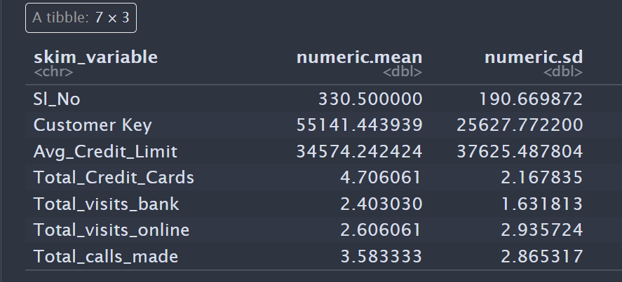
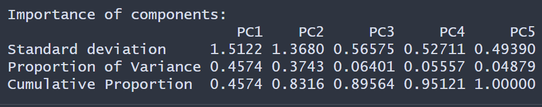
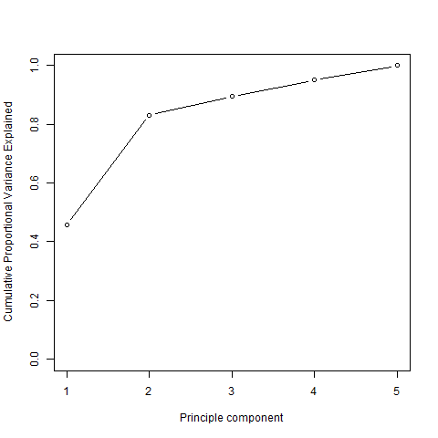
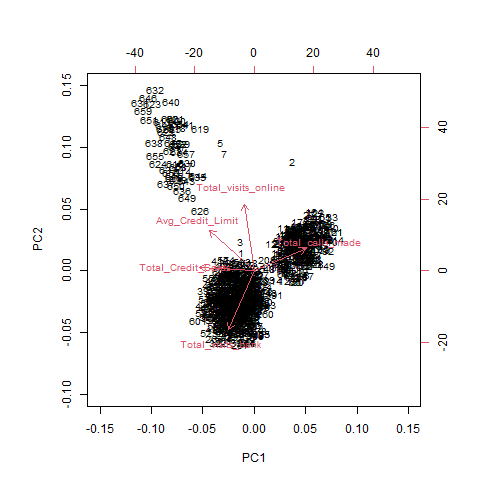
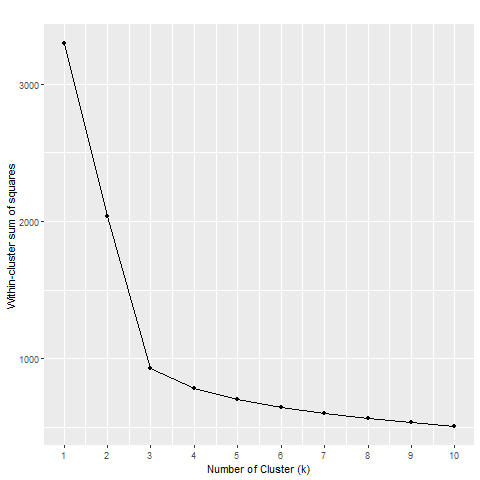
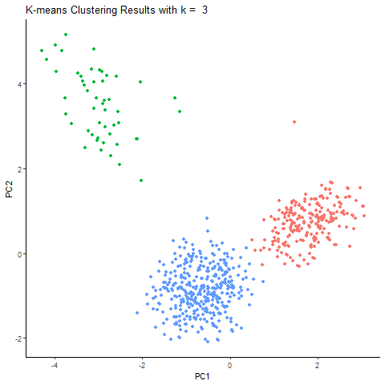
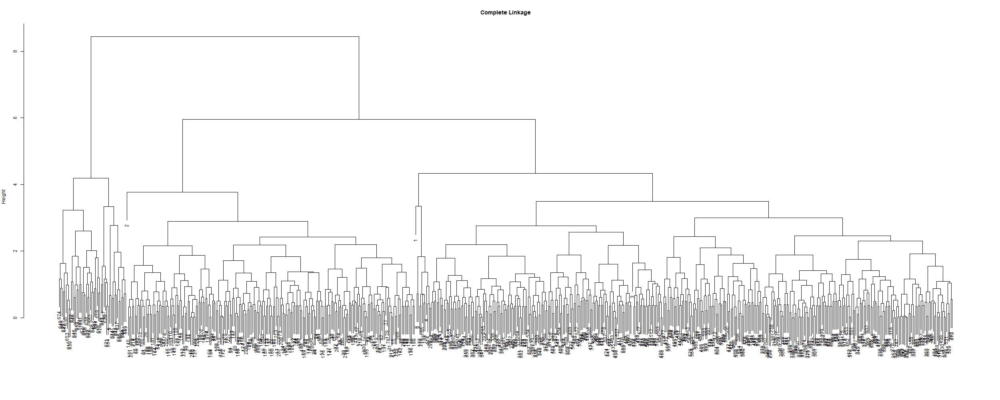
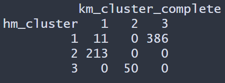
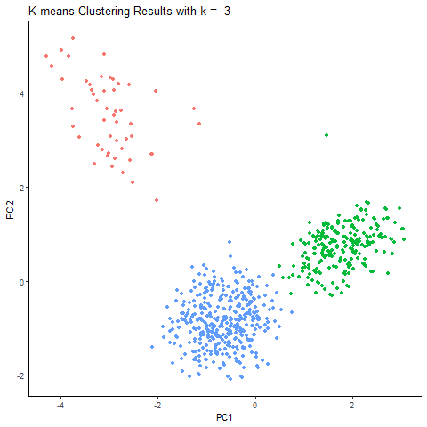

# PCA & Cluster Analysis on Credit Card Customer data

Performed PCA to find low dimensional representation of the customer that explain a good fraction variation of the entire dataset. Also performed K-means and Hierarchical cluster to find the related customers.

The Credit Card Customer data is from [kaggle.com](https://www.kaggle.com/datasets/aryashah2k/credit-card-customer-data)

# Principal Components Analysis

The dataset does not have any NA values. The data was also normalized before PCA since clearly there is a difference between the average mean and variance between the variables.

The table below shows the PCA results. The first two principle components explain about 83.17% of the variability of the entire dataset.

The figure below, is the scree plot of the cumulative proportional variance.

Based on the plot below, show the first component has more weight in `Total_calls_made`, `Avg_Credit_Limit`, and `Total_Credit_Cards` and less on `Total_visits_online`. While the second component has more weight on `Total_visits_online`. The plot also show that the `Total_visits_online` and `Avg_Credit_Limit` are correlated with each other. Meaning, customer with high credit limit tend to have a higher total visit online. 

## k-means

The data was normalized before performing K-means. The "Elbow method" was used to determine number of clusters to be used. The plot below is the within cluster sum of squares against k (number of cluster). We choose to select k = 3 since, the slope become more linear as k > 3.

For k=3, about 71% of variation is explain by the clusters. The figure below is the k-means customer output on the first two principal components.

## Hierarchical cluster

Used hierarchical cluster using Average and Complete linkage. Results are very similar between the two linkage shown below.

Here we choose to 3 cluster to compare the results with the k-means cluster to show how different the two methods can be.

## Performed k-means cluster on PCA first two components

When performing K-means on the first two principal components, about 86% of variation is explain by the clusters. There is a 15% difference when performing on first two principal components compare to using the entire dataset.

